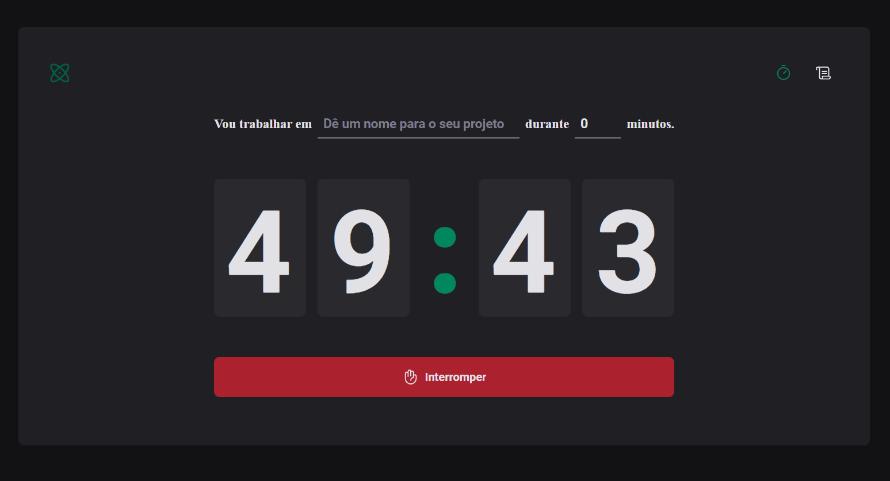

# Pomodoro App

Este é um aplicativo Pomodoro desenvolvido em React com TypeScript. Ele inclui um temporizador Pomodoro e uma página de histórico de todos os ciclos já realizados.

## Funcionalidades

- **Temporizador Pomodoro:** Utilize o método Pomodoro para gerenciar seu tempo com sessões de trabalho e intervalos.
- **Histórico de Ciclos:** Visualize um registro de todos os ciclos Pomodoro concluídos.

## Instalação

1. Certifique-se de ter o Node.js instalado em sua máquina.
2. Clone este repositório para o seu ambiente local
